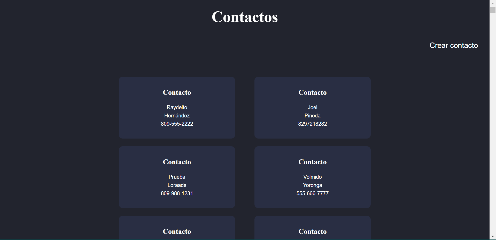
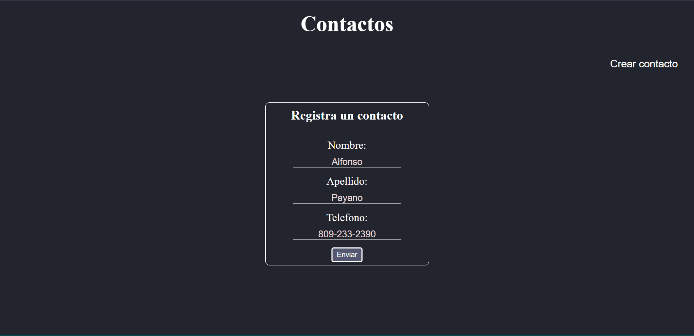
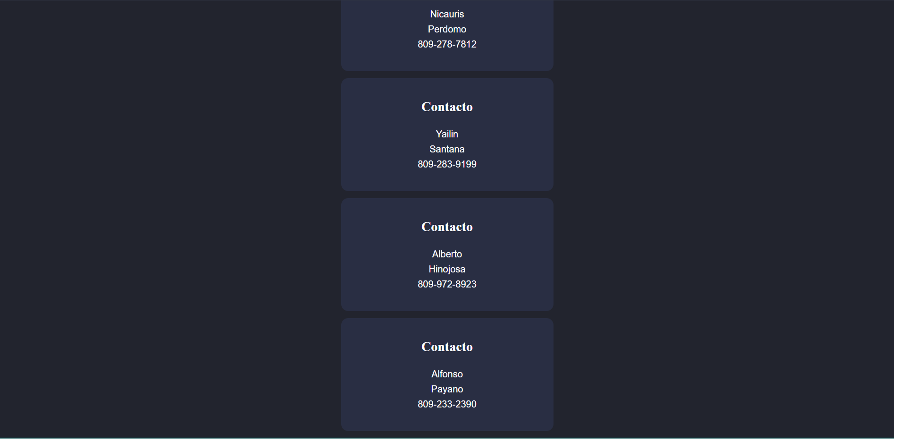

## Tarea #3 - Basilio Gianfranco De Paula Cuevas (2020-10552)

### Agenda multicapas 

Haga una agenda WEB la cual mostrará el listado de todos los contactos guardados en la agenda y permitirá almacenar nuevos contactos.

De cada contacto se almacenarán su nombre, apellido y teléfono.

Utilizando la función fetch usted podrá obtener mediante el método HTTP GET el listado de todos los contactos almacenados en la agenda en formato JSON mediante el siguiente enlace: http://www.raydelto.org/agenda.php . De igual modo, invocando la misma URL mediante el método POST de HTTP y enviando un cuerpo JSON con los campos nombre, apellido, telefono usted podrá agregar nuevos contactos a su agenda.

